```{r setup, include=FALSE}
knitr::opts_chunk$set(echo = TRUE)
knitr::opts_chunk$set(fig.dim=c(4.8, 4.5), fig.retina=2, out.width="100%", out.height = "100%")

library(extrafont)
# font_import()
loadfonts(device = "win")

library(osmdata)
library(sf)
library(tidyverse)
library(tmap)

```

class: inverse
name: slide1

## Structure

**Focus on the process** of making a map using OSM data in R.

--

.pull-left[

- Thematic Mapping: A brief introduction

- Conceptual ideas for working with R

- Making a map in R using OSM Data

- Open for discussion

]

---

class: inverse
name: slide2

## Who I am (and not)

.pull-left[

- **Not a Developer**

  - Not about the code/ coding better
  
- **Not a cartographer**

  - Not about making maps/ making maps better
  
- **Architect & Planner**

  - Maps to understand specific aspects of cities/ urban areas (Bangalore)
  
  - Thematic maps

  - OpenStreetMap Data

]

--

.pull-right[

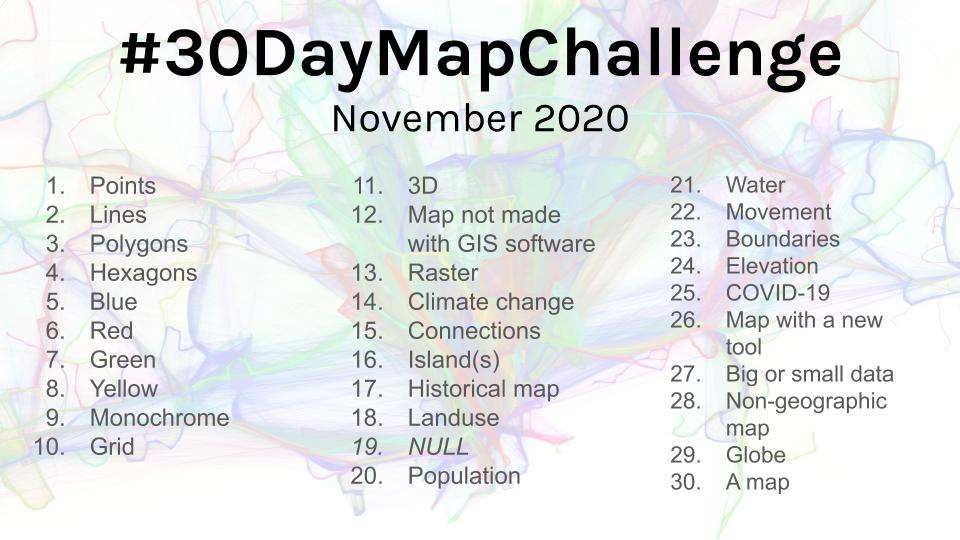

Initiated by Topi Tjukanov [@tjukanov](https://twitter.com/tjukanov) in 2019.

]

---

class: inverse
name: slide3

## Who I am (and not)


.pull-left[

- **Not a Developer**

  - Not about the code/ coding better
  
- **Not a cartographer**

  - Not about making maps/ making maps better
  
- **Architect & Planner**

  - Maps to understand specific aspects of cities/ urban areas (Bangalore)
  
  - Thematic maps

  - OpenStreetMap Data

]

.pull-right[

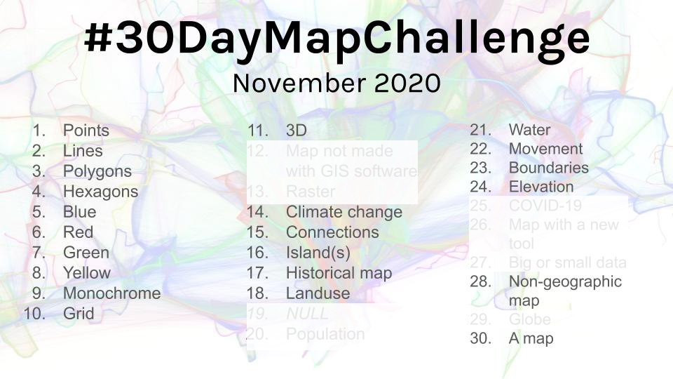

Initiated by Topi Tjukanov [@tjukanov](https://twitter.com/tjukanov) in 2019.

]

---
class: inverse, center, middle
name: slide4

## Thematic Mapping

---

class: inverse
name: slide5

## Thematic Mapping


.pull-left[

**Thematic maps** show geographical patterns for a some subject matter.

- Primary focus is to **communicate information about the subject matter**. Everything else is secondary.

- Not meant to be used for geographical location (navigation).

- Language, population, temperature

]

---

class: inverse
name: slide6

## Examples

.pull-left[

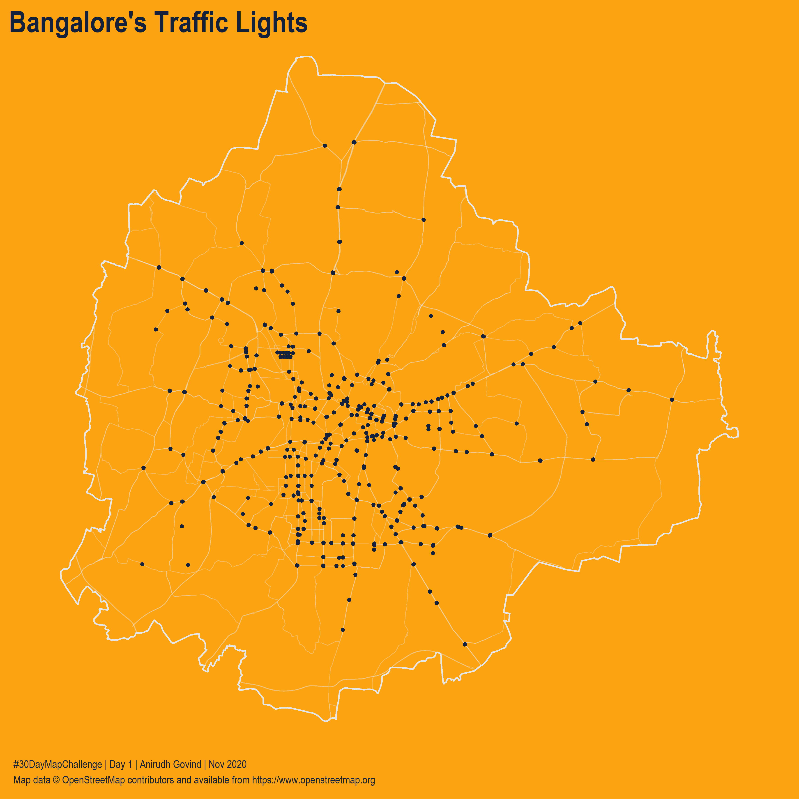

]

--

.pull-right[

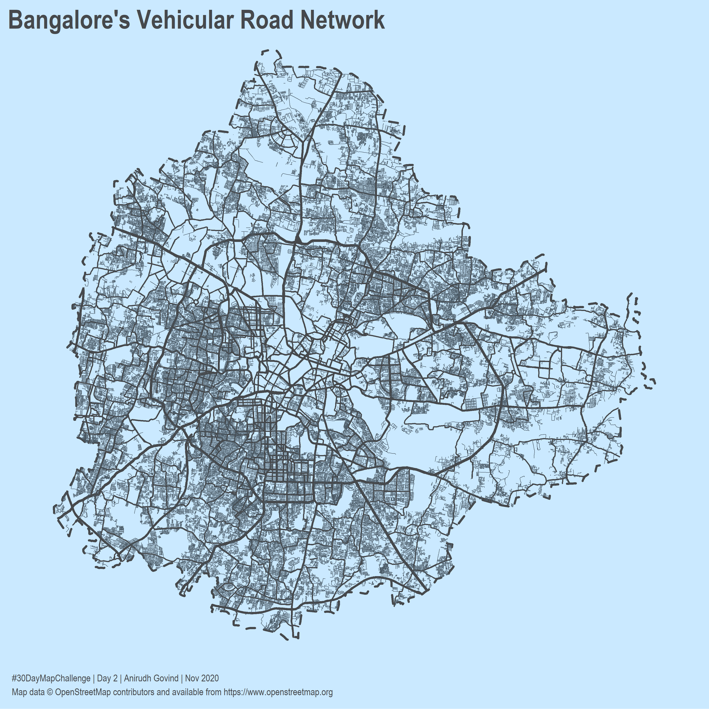

]

---

class: inverse
name: slide7

## Examples

.pull-left[

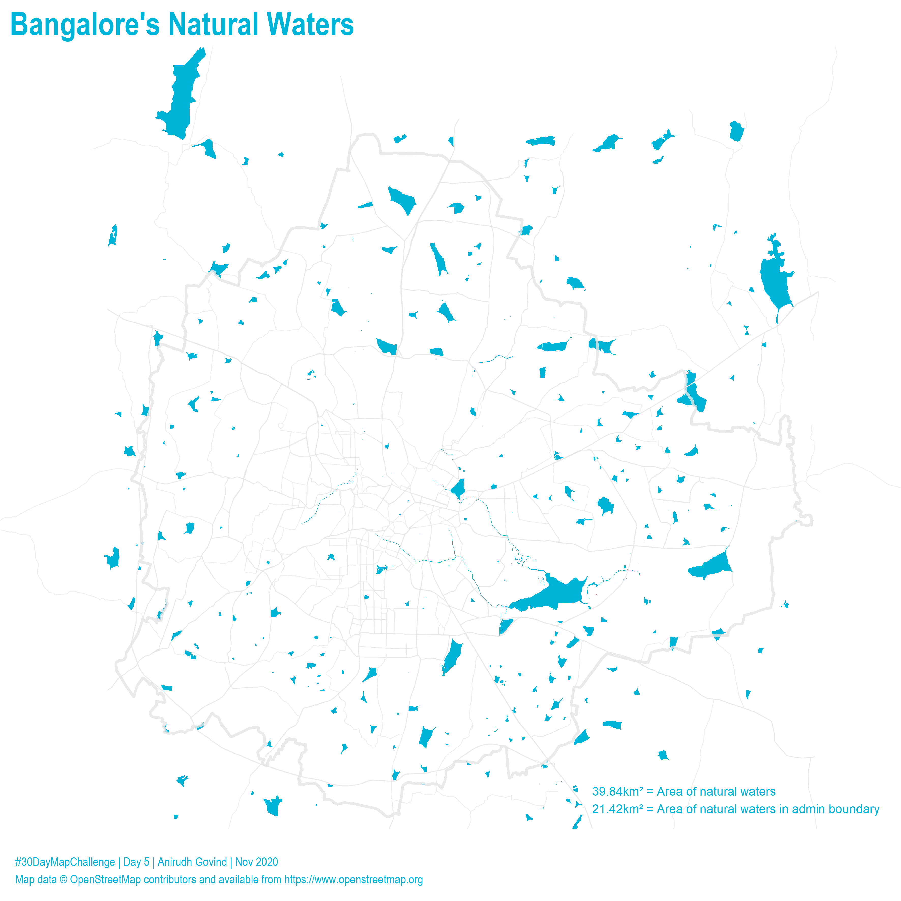

]

--

.pull-right[

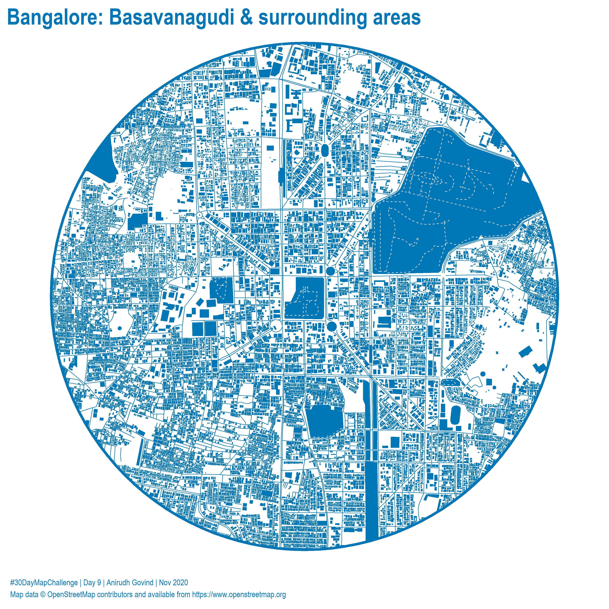

]

---

class: inverse, center, middle
name: slide8

## Conceptual Ideas for working with R

---

class: inverse
name: slide9

## How do we make a map?

.pull-left[

**Steps in making a map**

1. Obtain data

2. Ensure this data is relevant & properly structured

3. Put the map together with appropriate representation

]

---

class: inverse
name: slide10

## 1. Obtain Data

--

.pull-left[

OSM uses [`tags`](https://wiki.openstreetmap.org/wiki/Tags) to describe features in maps.

[`Tags`](https://wiki.openstreetmap.org/wiki/Tags) have two parts: a [`key`](https://wiki.openstreetmap.org/wiki/Category:Keys) and a corresponding [`value`](https://wiki.openstreetmap.org/wiki/Map_features)

Various methods are available for downloading data.

- OSM website

- Data extracts

- APIs (overpass)

]

--

.pull-right[

In R, we can get OpenStreetMap data using the {[`osmdata`](https://docs.ropensci.org/osmdata/)} package!

]

---

class: inverse
name: slide11

## 1. Obtain Data

{[`osmdata`](https://docs.ropensci.org/osmdata/)} package!

--

.pull-left[

```{r, echo=TRUE, results=FALSE, warning=FALSE, message=FALSE, eval=FALSE}

# Build a query

query <- getbb("LOCATION") %>%
  opq() %>%
  add_osm_feature("KEY", "VALUE")

# Query the OSM database (overpass)

data <- osmdata_sf(query)

# Extract geometry

dataExtract <- data$osm_points OR

dataExtract <- data$osm_lines OR

dataExtract <- data$osm_polygons

```

]

--

.pull-right[

```{r, echo=TRUE, results=FALSE, warning=FALSE, message=FALSE, eval=FALSE}

# Get traffic lights or signals location data from OSM.

# Build a query

query <- getbb("Bangalore") %>%
  opq() %>%
  add_osm_feature("highway", "traffic_signals")

# Query the OSM database (overpass)

trafficSignalsData <- osmdata_sf(query)

# Extract geometry

trafficSignals <- trafficSignalsData$osm_points

```

]

---

class: inverse
name: slide12

## 2. Tidy Data

Data is often messy!

--

.pull-left[

R relies on the [`tidy data framework`](http://statseducation.com/Introduction-to-R/modules/tidy%20data/tidy-data/)

1. Every variable has its own column

2. Every observation has its own row

3. Every value has its own cell

The {[`tidyr`](https://tidyr.tidyverse.org/)} and {[`dplyr`](https://dplyr.tidyverse.org/)} packages provide a set of tools for wrangling data into this format.

]

.pull-right[


Hadley Wickham and Garrett Grolemund. 2017. R for Data Science: Import, Tidy, Transform, Visualize, and Model Data (1st. ed.). O'Reilly Media, Inc.

]

--

.footnote[

The {[`tidyr`](https://tidyr.tidyverse.org/)} and {[`dplyr`](https://dplyr.tidyverse.org/)} packages are part of the [`Tidyverse`](https://www.tidyverse.org/); a set of packages sharing the same design philosophies, grammar and data structures.

]

---

class: inverse
name: slide13

## 2. Tidy Data

The {[`osmdata`](https://docs.ropensci.org/osmdata/)} package gives us tidy data!

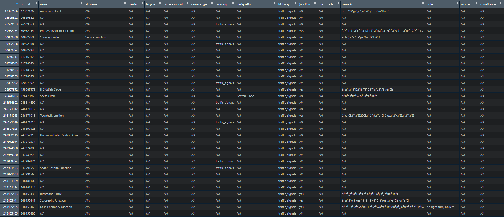

---

class: inverse
name: slide14

## 2. Tidy Data

```{r, echo=FALSE, results=TRUE, warning=FALSE, message=FALSE}

trafficSignals <- readRDS(here::here("data/trafficSignals.rds"))

glimpse(trafficSignals)

```

---

class: inverse
name: slide15

## 2. Tidy Data

We can further clean up the data by keeping only the columns we need; `osm_id` and the `geometry`

.pull-left[

```{r, eval=FALSE, echo=TRUE}

# Select specific columns

trafficSignals %>% 
  select(osm_id, geometry)

```

]

.pull-right[

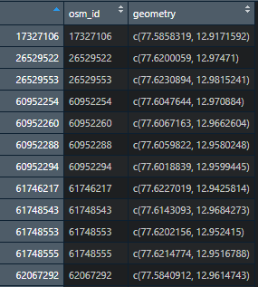

]

---

class: inverse
name: slide16

## How do we make a map?

.pull-left[

**Steps in making a map**

1. Obtain data

2. Ensure this data is relevant & properly structured

3. Put the map together with appropriate representation

]

--

.pull-right[

**How we go about doing it**

1. OpenStreetMap - {[`osmdata`](https://docs.ropensci.org/osmdata/)}

2. Tidy it - {[`tidyr`](https://tidyr.tidyverse.org/)} & {[`dplyr`](https://dplyr.tidyverse.org/)} - which are part of the {[`Tidyverse`](https://www.tidyverse.org/)}

3. ?

]

--

## Questions?

---

class: inverse
name: slide17

## 3. Present Data

A layered approach with the Grammar of Graphics!

.pull-left[

Hadley Wickham (2010) [`A Layered Grammar of Graphics`](https://vita.had.co.nz/papers/layered-grammar.html), Journal of Computational and Graphical Statistics, 19:1, 3-28, DOI: 10.1198/jcgs.2009.07098 

]

--

.pull-right[

We build maps or visualizations step-by-step rather than a trial and error approach.

1. Geometry or Shape; points, lines or polygons or a combination of them

2. Data;

3. Aesthetics; colour, size, transparency, etc

4. Composition; titles, sub-titles, footnotes, graphic scales, etc

]

---

class: inverse
name: slide18

## 3. Present Data

A layered approach with the Grammar of Graphics!

.pull-left[

```{r, echo=FALSE, results=FALSE, warning=FALSE, message=FALSE}

# Load Bangalore ward data

bangaloreWards <- read_sf(here::here("data/bangaloreWardsUTM.shp"))

bangaloreWards <- bangaloreWards %>% 
  st_transform(3857)

```

```{r, eval=FALSE, echo=TRUE}

# Plot Bangalore ward map using borders

tm_shape(bangaloreWards) +
  tm_borders()

```

]

--

.pull-right[

```{r, echo=FALSE, results=TRUE, warning=FALSE, message=FALSE}

tm_shape(bangaloreWards) +
  tm_borders()
```

]

---

class: inverse
name: slide19

## 3. Present Data

A layered approach with the Grammar of Graphics!

.pull-left[

```{r, eval=FALSE, echo=TRUE}

# Fill with different colours

tm_shape(bangaloreWards) +
  tm_borders() +
  tm_fill(col = "#E5E5E5")

```

]

.pull-right[

```{r, echo=FALSE, results=TRUE, warning=FALSE, message=FALSE}

tm_shape(bangaloreWards) +
  tm_borders() +
  tm_fill(col = "#E5E5E5")
```

]

---

class: inverse
name: slide20

## 3. Present Data

A layered approach with the Grammar of Graphics!

.pull-left[

```{r, eval=FALSE, echo=TRUE}

# Add traffic signals

tm_shape(bangaloreWards) +
  tm_borders() +
  tm_fill(col = "#E5E5E5") +
  tm_shape(trafficSignals) +
  tm_dots(size = 0.1,
          col = "#FFB703")

```

]

.pull-right[

```{r, echo=FALSE, results=TRUE, warning=FALSE, message=FALSE}

tm_shape(bangaloreWards) +
  tm_borders() +
  tm_fill(col = "#E5E5E5") +
  tm_shape(trafficSignals) +
  tm_dots(size = 0.1,
          col = "#FFB703")
```

]

---

class: inverse
name: slide21

## 3. Present Data

A layered approach with the Grammar of Graphics!

.pull-left[

```{r, eval=FALSE, echo=TRUE}

# Add titles

tm_shape(bangaloreWards) +
  tm_borders() +
  tm_fill(col = "#E5E5E5") +
  tm_shape(trafficSignals) +
  tm_dots(size = 0.1,
          col = "#FFB703") +
  tm_layout(main.title = "Bangalore's Traffic Lights",
            frame = F)

```

]

.pull-right[

```{r, echo=FALSE, results=TRUE, warning=FALSE, message=FALSE}

# Add titles

tm_shape(bangaloreWards) +
  tm_borders() +
  tm_fill(col = "#E5E5E5") +
  tm_shape(trafficSignals) +
  tm_dots(size = 0.1,
          col = "#FFB703") +
  tm_layout(main.title = "Bangalore's Traffic Lights",
            frame = F)

```

]

---

class: inverse
name: slide22

## How do we make a map?

.pull-left[

**Steps in making a map**

1. Obtain data

2. Ensure this data is relevant & properly structured

3. Put the map together with appropriate representation

]

.pull-right[

**How we go about doing it**

1. OpenStreetMap - {[`osmdata`](https://docs.ropensci.org/osmdata/)}

2. Tidy it - {[`tidyr`](https://tidyr.tidyverse.org/)} & {[`dplyr`](https://dplyr.tidyverse.org/)} - which are part of the {[`Tidyverse`](https://www.tidyverse.org/)}

3. [`Grammar of Graphics`](https://vita.had.co.nz/papers/layered-grammar.html) - using the {[`tmap`](https://cran.r-project.org/web/packages/tmap/vignettes/tmap-getstarted.html)} package

]

--

## Questions?

--

.pull-left[

[See another example!](#slide23)

]


.pull-right[

[Summarize!](#slide32)

]
 
---

class: inverse, middle, center
name: slide23

## Let's make a map!

---

class: inverse
name: slide24

## Bangalore's Parks

.pull-left[

Let's recreate this map showing Bangalore's Parks!

]

.pull-right[

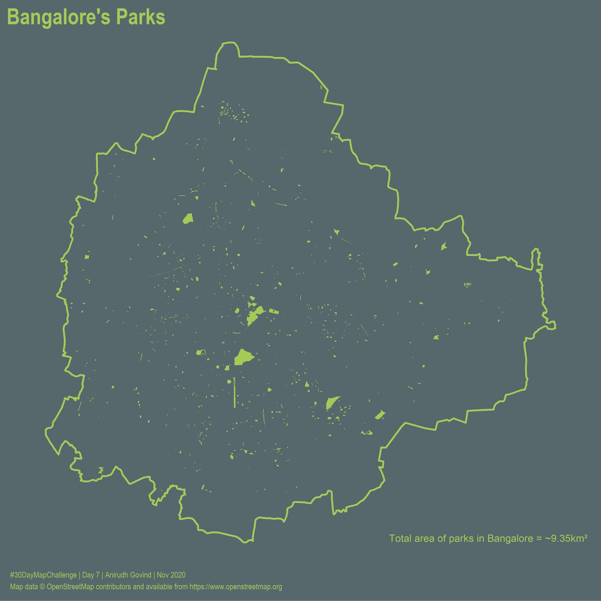

]

---

class: inverse
name: slide25

## Bangalore's Parks

.pull-left[

```{r, echo=TRUE, results=FALSE, warning=FALSE, message=FALSE}

# Load Bangalore ward data and transform it

bangaloreWardBoundary <- read_sf(here::here("data/bangaloreWardBoundary.shp"))

bangaloreWardBoundary <- bangaloreWardBoundary %>% 
  st_transform(3857)

```

]

--

.pull-right[

```{r, echo=TRUE, results=FALSE, warning=FALSE, message=FALSE, eval=FALSE}

# Get parks data from OSM

# Build a query

query <- getbb("Bangalore") %>%
  opq() %>%
  add_osm_feature("leisure", "park")

# Query the OSM database (overpass)

parksData <- osmdata_sf(query)

# Extract geometry

parks <- parksData$osm_polygons

```

]

---

class: inverse
name: slide26

## Bangalore's Parks

.pull-left[


```{r, echo=FALSE, results=TRUE, warning=FALSE, message=FALSE}

parks <- readRDS(here::here("data/parks.rds"))

# Extract data

parks <- parks$osm_polygons

```

```{r, echo=TRUE, results=FALSE, warning=FALSE, message=FALSE}

# Tidy the parks data and keep only necessary columns

parks <- parks %>% 
  select(osm_id, geometry)

# Transform

parks <- parks %>% 
  st_transform(3857)

# Keep only those parks which are within the boundary

bangaloreParks <- st_intersection(parks, bangaloreWardBoundary)

```

]

--

.pull-right[

```{r, echo=TRUE, results=FALSE, warning=FALSE, message=FALSE}

# Calculate areas of parks

bangaloreParks <- bangaloreParks %>% 
  mutate(area = st_area(.)) %>%
  mutate(area = as.numeric(area)) %>% 
  mutate(area = round(area, 2))

```

]

---

class: inverse
name: slide27

## Bangalore's Parks

.pull-left[

```{r, eval=FALSE, echo=TRUE}

# Plot Bangalore ward map using borders

tm_shape(bangaloreWardBoundary) +
  tm_borders()

```

]

--

.pull-right[

```{r, echo=FALSE, results=TRUE, warning=FALSE, message=FALSE}

tm_shape(bangaloreWardBoundary) +
  tm_borders()
```

]

---

class: inverse
name: slide28

## Bangalore's Parks

.pull-left[

```{r, eval=FALSE, echo=TRUE}

# Plot Bangalore's Parks

tm_shape(bangaloreWardBoundary) +
  tm_borders() +
  tm_shape(bangaloreParks) +
  tm_fill()

```

]

.pull-right[

```{r, echo=FALSE, results=TRUE, warning=FALSE, message=FALSE}

tm_shape(bangaloreWardBoundary) +
  tm_borders() +
  tm_shape(bangaloreParks) +
  tm_fill()

```

]

---

class: inverse
name: slide29

## Bangalore's Parks

.pull-left[

```{r, eval=FALSE, echo=TRUE}

# Add colours and lineweights

tm_shape(bangaloreWardBoundary) +
  tm_borders(col = "#a7c957",
             lwd = 3) +
  tm_shape(bangaloreParks) +
  tm_fill(col = "#a7c957")

```

]

.pull-right[

```{r, echo=FALSE, results=TRUE, warning=FALSE, message=FALSE}

tm_shape(bangaloreWardBoundary) +
  tm_borders(col = "#a7c957",
             lwd = 3) +
  tm_shape(bangaloreParks) +
  tm_fill(col = "#a7c957")

```

]

---

class: inverse
name: slide30

## Bangalore's Parks

.pull-left[

```{r, eval=FALSE, echo=TRUE}

# Add background colour and margins

tm_shape(bangaloreWardBoundary) +
  tm_borders(col = "#a7c957",
             lwd = 3) +
  tm_shape(bangaloreParks) +
  tm_fill(col = "#a7c957") +
  tm_layout(bg.color = "#56666b",
            frame = F,
            frame.lwd = NA,
            attr.outside = T,
            outer.margins = 0,
            asp = 0,
            scale = 0.8)

```

]

.pull-right[

```{r, echo=FALSE, results=TRUE, warning=FALSE, message=FALSE}

tm_shape(bangaloreWardBoundary) +
  tm_borders(col = "#a7c957",
             lwd = 3) +
  tm_shape(bangaloreParks) +
  tm_fill(col = "#a7c957") +
  tm_layout(bg.color = "#56666b",
            frame = F,
            frame.lwd = NA,
            attr.outside = T,
            outer.margins = 0,
            asp = 0,
            scale = 0.8)

```

]

---

class: inverse
name: slide31

## Bangalore's Parks

.pull-left[

```{r, eval=FALSE, echo=TRUE}

# Add titles and sub-titles

tm_shape(bangaloreWardBoundary) +
  tm_borders(col = "#a7c957",
             lwd = 3) +
  tm_shape(bangaloreParks) +
  tm_fill(col = "#a7c957") +
  tm_layout(bg.color = "#56666b",
            frame = F,
            attr.outside = T,
            outer.margins = 0,
            asp = 0,
            scale = 0.8,
            main.title = "Bangalore's Parks",
            main.title.color = "#a7c957",
            main.title.size = 1.75,
            main.title.fontfamily = "Arial Narrow",
            title = "Total area of parks in Bangalore = ~9.35km²",
            title.color = "#a7c957",
            title.size = 0.6,
            title.position = c("right", "bottom"))

```

]

.pull-right[

```{r, echo=FALSE, results=TRUE, warning=FALSE, message=FALSE}

tm_shape(bangaloreWardBoundary) +
  tm_borders(col = "#a7c957",
             lwd = 3) +
  tm_shape(bangaloreParks) +
  tm_fill(col = "#a7c957") +
  tm_layout(bg.color = "#56666b",
            frame = F,
            attr.outside = T,
            outer.margins = 0,
            asp = 0,
            scale = 0.8,
            main.title = "Bangalore's Parks",
            main.title.color = "#a7c957",
            main.title.size = 1.75,
            main.title.fontfamily = "Arial Narrow",
            title = "Total area of parks in Bangalore = ~9.35km²",
            title.color = "#a7c957",
            title.size = 0.6,
            title.position = c("right", "bottom"))

```

]

---

class: inverse
name: slide32

## Examples

.pull-left[

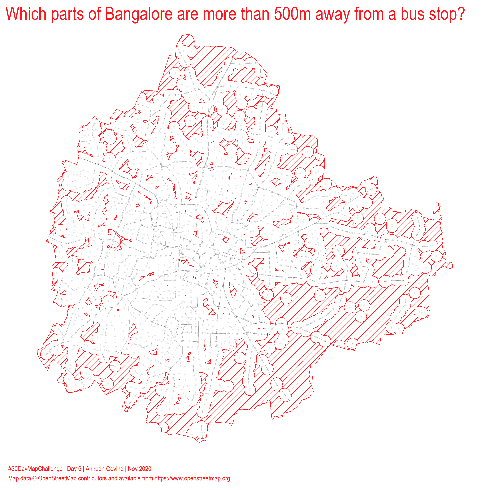

]

--

.pull-right[

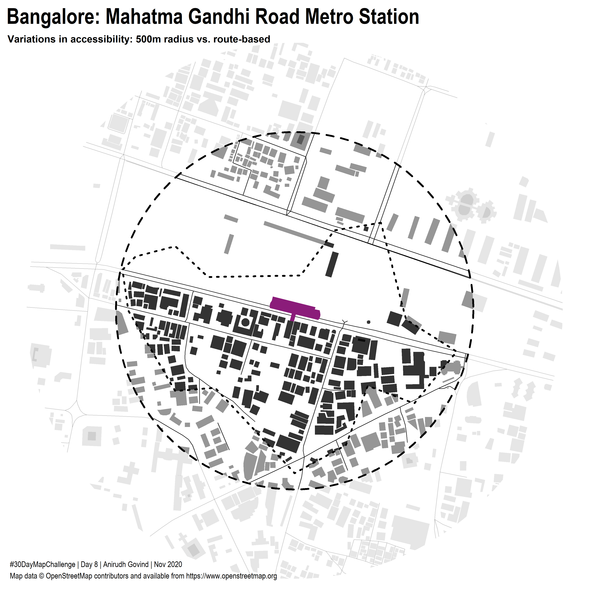

]

---

class: inverse
name: slide33

## Examples

.pull-left[

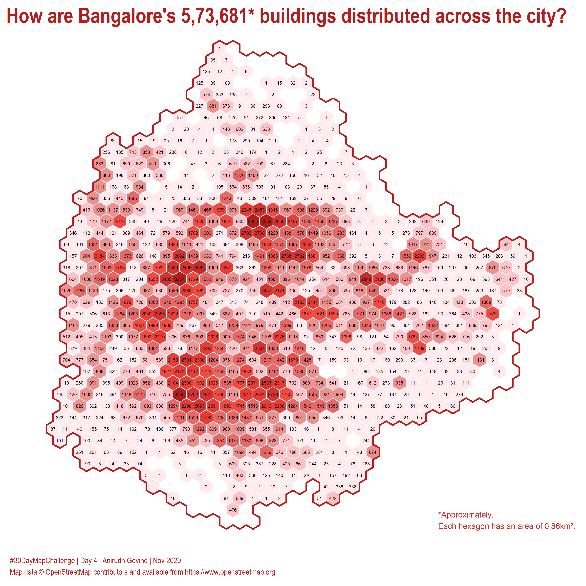

]

--

.pull-right[

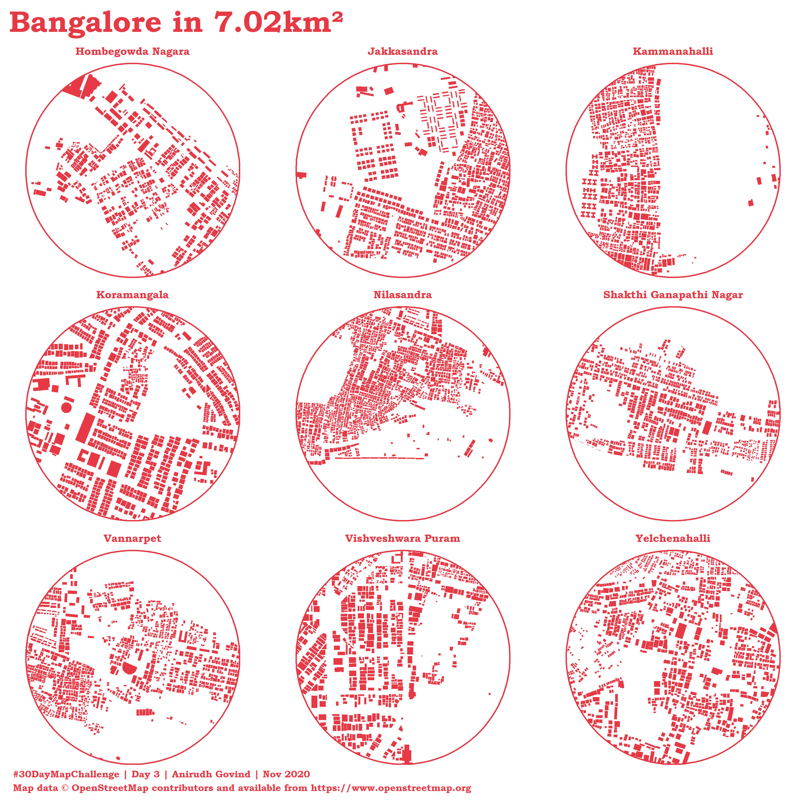

]

---

class: inverse
name: slide34

## Summary

.pull-left[

What we've seen today:

- A brief introduction to thematic mapping

- Core concepts for working with R

  - Getting data from OSM with the {[`osmdata`](https://docs.ropensci.org/osmdata/)} package
  
  - Tidy data with the {[`tidyr`](https://tidyr.tidyverse.org/) and [`dplyr`](https://dplyr.tidyverse.org/)} packages which are part of the {[`tidyverse`](https://www.tidyverse.org/)}
  
  - Making maps based on the [`Grammar of Graphics`](https://vita.had.co.nz/papers/layered-grammar.html) using the {[`tmap`](https://cran.r-project.org/web/packages/tmap/vignettes/tmap-getstarted.html)} package 
  
- Put this into practice with an example

- Examples of maps made with OSM data

]

---

class: inverse, middle, center
name: slide35

# Thanks!

Code used to create all the maps can be found on  [github](https://github.com/anirudhgovind/30DayMapChallenge)!

Find me on twitter at [_anirudhgovind](https://twitter.com/_anirudhgovind)

<br><br><br><br><br>

Slides created using the R package {[`xaringan`](https://slides.yihui.org/xaringan/#1)}]
